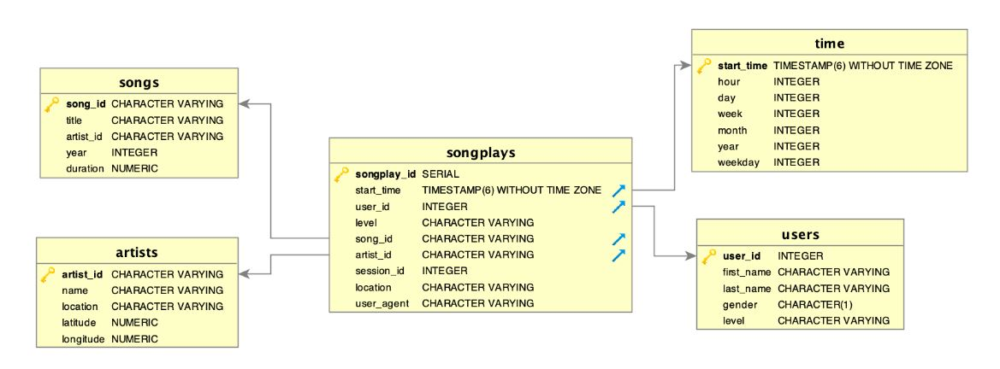

#  Data Pipelines: Building pipelines with Airflow, AWS S3 and Redshift

## Summary
- [Introduction](#Introduction)
- [The Goal](#The-Goal)
- [Tool](#Tool)
- [Database & Pipeline](#Database-&-Pipeline)
### Introduction

A music streaming company, Sparkify, has decided that it is time to introduce more automation and monitoring to their data warehouse ETL pipelines and come to the conclusion that the best tool to achieve this is Apache Airflow.

They have decided to bring you into the project and expect you to create high grade data pipelines that are dynamic and built from reusable tasks, can be monitored, and allow easy backfills. They have also noted that the data quality plays a big part when analyses are executed on top the data warehouse and want to run tests against their datasets after the ETL steps have been executed to catch any discrepancies in the datasets.

The source data resides in S3 and needs to be processed in Sparkify's data warehouse in Amazon Redshift. The source datasets consist of JSON logs that tell about user activity in the application and JSON metadata about the songs the users listen to.
***
### The Goal
The goal is to build a data pipeline to injest data from S3 to Redshift hourly. 
***
### Tool
[Airflow](https://airflow.apache.org/): Airflow is a platform to programmatically author, schedule and monitor workflows. Use airflow to author workflows as directed acyclic graphs (DAGs) of tasks. The airflow scheduler executes your tasks on an array of workers while following the specified dependencies. Rich command line utilities make performing complex surgeries on DAGs a snap. The rich user interface makes it easy to visualize pipelines running in production, monitor progress, and troubleshoot issues when needed.

[AWS S3](https://aws.amazon.com/s3/): Customers of all sizes and industries can use it to store and protect any mount of data for a range of use cases, such as websites, mobile applications, backup and restore, archive, enterprise applications, IoT devices, and big data analytics. 

In this project, Song and Log data files are stored in two public ``S3 Buckets``. The file path can be found in ``dwh.cfg`` file.

[AWS Redshift](https://aws.amazon.com/redshift/): Amazon Redshift is a fast, scalable data warehouse that makes it simple and cost-effective to analyze all your data across your data warehouse and data lake.

In this project, two staging tables, one fact table and four dimension tables are created in Redshift.

***
### Database & Pipeline
Song and Log datasets are saved in AWS S3. A star schema is created including one fact table: **songplays**, and four dimension tables: **users**, **songs**, **artists** and **time**. The Song data and Log data are initially ingested into two stage tables. Then another pipeline is built to transfer data from stage tables to 5 above tables. 

The schema is shown as below:

***
